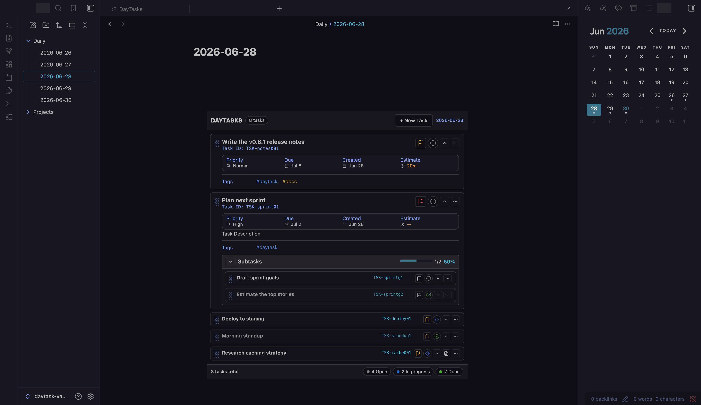
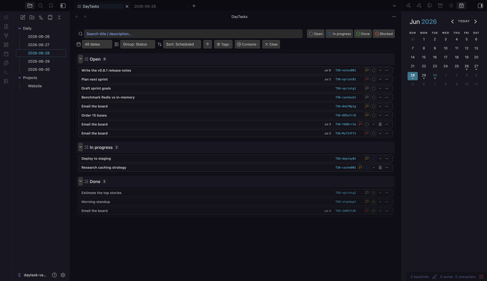
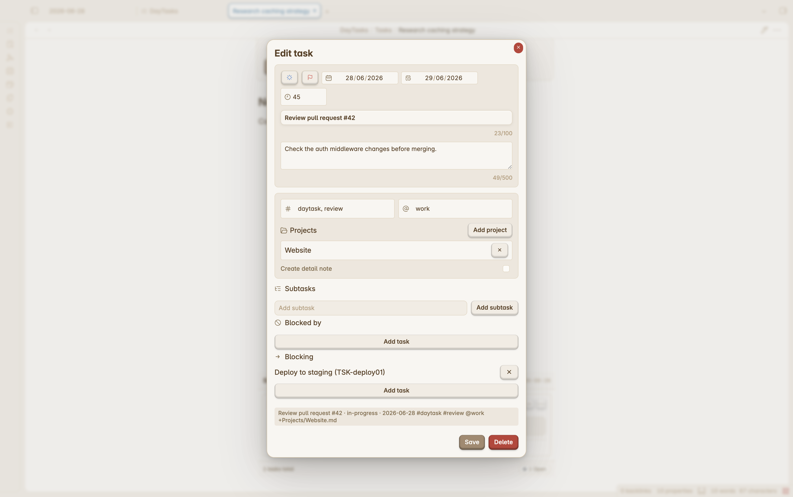
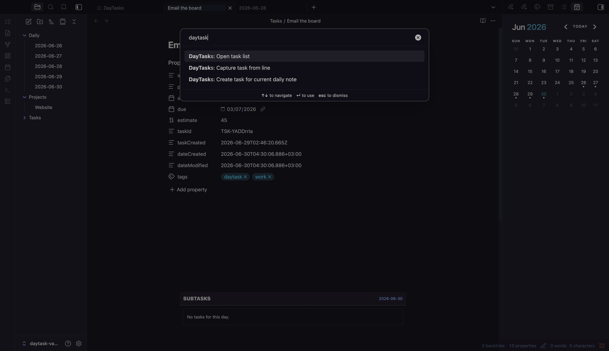
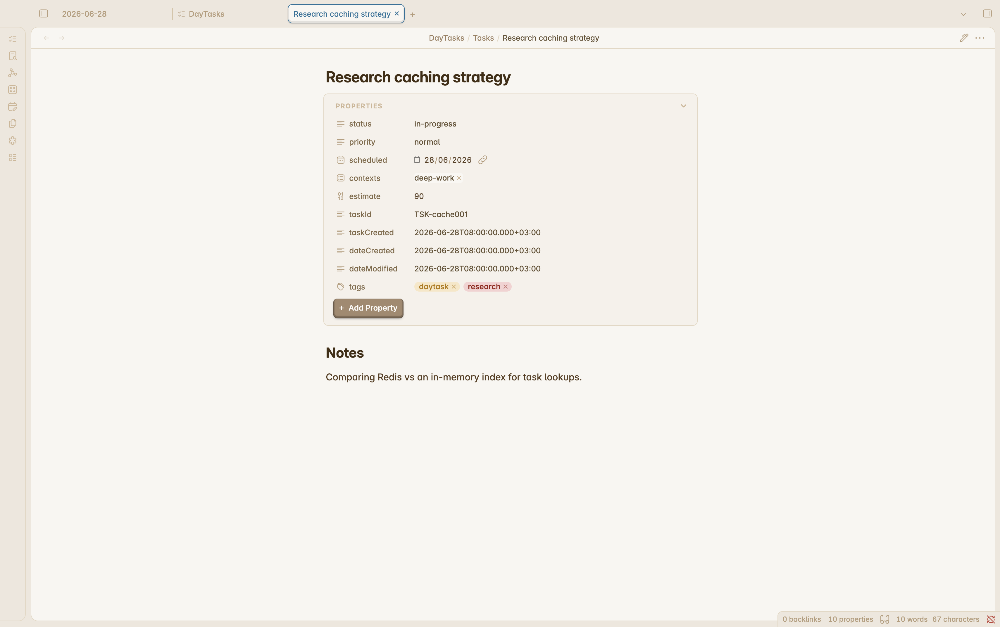
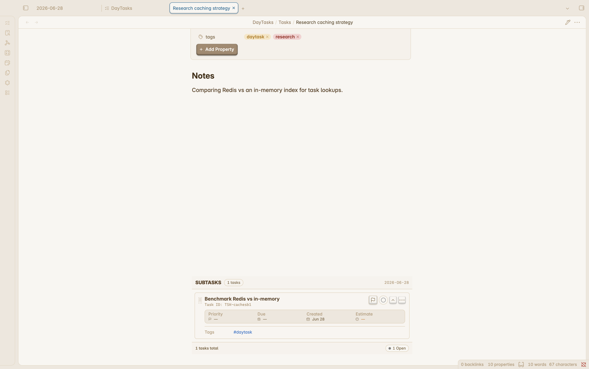
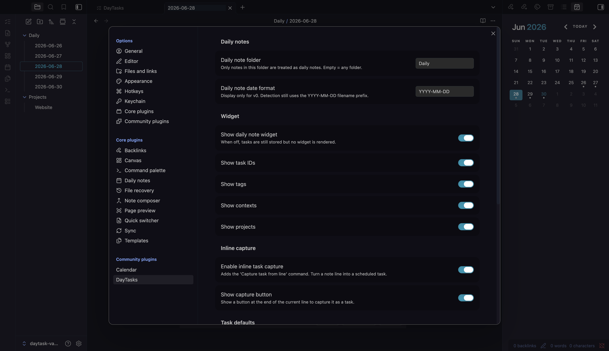

# DayTasks

A lightweight, day-first task manager for your Obsidian daily notes.



DayTasks is built for people who plan from daily notes but still want structured
task cards, filtering, subtasks, dependencies, and optional detail notes. It
keeps task data in Obsidian plugin storage and renders tasks inside your daily
notes, so your note body stays yours.

```text
plugin task store -> task index -> daily-note widget -> task cards
```

Stable `TSK-xxxxxxxx` IDs let cards, detail notes, subtasks, dependencies, and
project links all point at the same task without turning every task into a
Markdown file.

## Status

DayTasks is under active development and is being prepared for public release.
It is currently desktop-only and English-only.

API, browser extension, sync, and i18n work are out of scope until the Obsidian
plugin experience is complete.

## Requirements

- Obsidian `1.8.0` or newer.
- Desktop Obsidian. DayTasks is currently marked `isDesktopOnly`.

## Features

- Daily-note widget in Live Preview and reading mode.
- Task creation, editing, completion, deletion, status cycling, and priority
  cycling.
- Scheduled dates, due dates, tags, contexts, project links, estimates, and
  descriptions.
- Collapsible task cards with manual drag reorder.
- Subtasks with nested cards and progress.
- Dependencies with blocked-status behavior and cycle prevention.
- Task List view for all tasks across days, with filtering, grouping, sorting,
  and persisted view state.
- Optional Markdown detail notes with managed task frontmatter and a user-owned
  body.
- Detail-note folder templates such as `Tasks/{{year}}/{{month}}`.
- Theme-aware styling, visible keyboard focus, and accessible icon controls.

## Screenshots

**Task List view** — every task across days in one place, filterable by status,
tag, context, and project, then grouped and sorted however you work.



**Create and edit tasks** — one dialog for scheduling, priority, due date,
estimate, tags, contexts, project links, subtasks, and dependencies.



**Commands** — open the Task List or create a task for the current daily note
straight from the command palette.



**Detail notes** — an optional Markdown note per task. DayTasks manages the task
frontmatter and injects an interactive subtasks widget; the note body stays
yours.





**Settings** — daily-note detection, which fields the widget shows, and the
defaults applied to new tasks.



## Install

DayTasks is not yet listed in Obsidian Community Plugins.

For local testing, build and install into the bundled test vault:

```bash
npm run build:test
```

To install into another vault:

```bash
npm run build
npm run install-plugin -- /path/to/Vault
```

The plugin is installed to:

```text
<vault>/.obsidian/plugins/daytasks/
```

When GitHub releases are available, install by copying the release assets
`manifest.json`, `main.js`, and `styles.css` into that same folder.

## Usage

1. Enable DayTasks in Obsidian.
2. Open a daily note named with a `YYYY-MM-DD` prefix, such as
   `2026-06-25.md`.
3. Use the daily-note widget or the `Create task for current daily note` command
   to create a task.
4. Open the Task List view from the ribbon icon or the `Open task list` command
   to review tasks across days.

See [Features](docs/features.md), [Settings](docs/settings.md), and
[Troubleshooting](docs/troubleshooting.md) for the full workflow.

## Data Model

DayTasks stores tasks in Obsidian plugin data, not in daily-note bodies. Optional
detail notes are normal Markdown files in your vault. DayTasks manages their
task frontmatter and leaves the note body untouched.

See [Core concepts](docs/core-concepts.md) and [Privacy](docs/privacy.md) for
details.

## Documentation

- [Documentation index](docs/index.md)
- [Core concepts](docs/core-concepts.md)
- [Features](docs/features.md)
- [Settings](docs/settings.md)
- [Roadmap](docs/roadmap.md)
- [Architecture](docs/development/architecture.md)
- [Testing](docs/development/testing.md)
- [Security and data safety](docs/development/security-and-data-safety.md)

## Development

Install dependencies, then run the local gate:

```bash
npm install
npm run check
```

Useful commands:

```bash
npm run check
npm run lint
npm run lint:md
npm run build
npm run build:test
```

To install the built plugin into a vault:

```bash
npm run install-plugin -- /path/to/Vault
```

## Release

DayTasks uses a local two-step release flow. Build artifacts are GitHub Release
assets, not committed files.

```bash
npm run release -- patch
npm run release:publish
```

See [Release process](docs/development/release-process.md) for details.

## License

[MIT](LICENSE)
